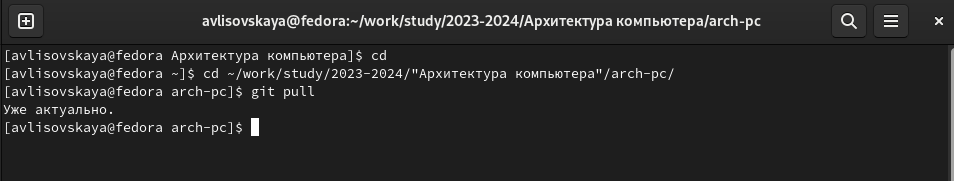
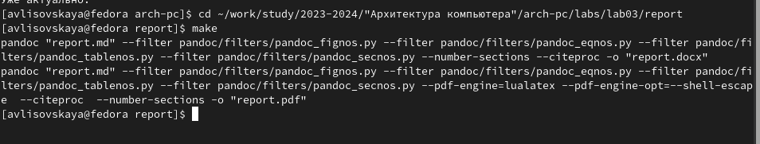
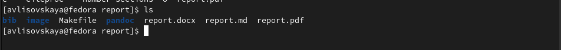
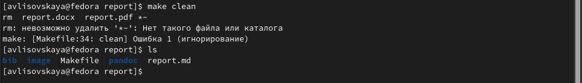
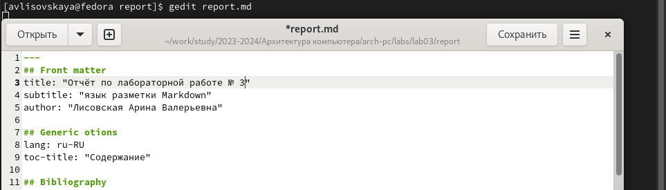
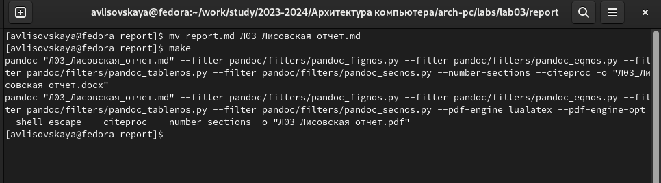
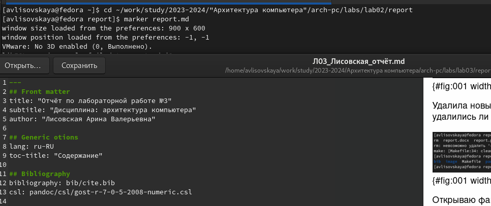
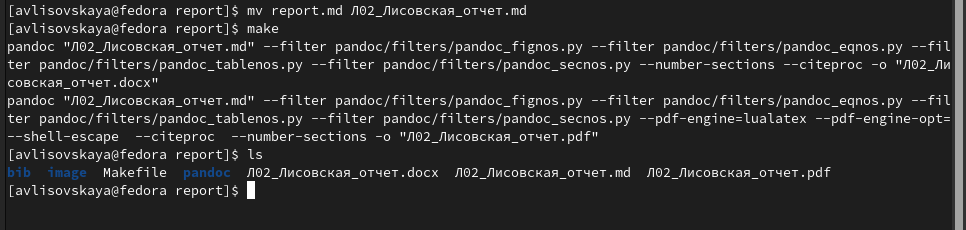
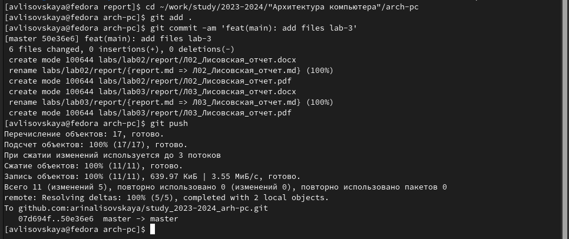

---
## Front matter
title: "Отчёт по лабораторной работе №3"
subtitle: "Дисциплина: архитектура компьютера"
author: "Лисовская Арина Валерьевна"

## Generic otions
lang: ru-RU
toc-title: "Содержание"

## Bibliography
bibliography: bib/cite.bib
csl: pandoc/csl/gost-r-7-0-5-2008-numeric.csl

## Pdf output format
toc: true # Table of contents
toc-depth: 2
lof: true # List of figures
lot: true # List of tables
fontsize: 12pt
linestretch: 1.5
papersize: a4
documentclass: scrreprt
## I18n polyglossia
polyglossia-lang:
  name: russian
  options:
	- spelling=modern
	- babelshorthands=true
polyglossia-otherlangs:
  name: english
## I18n babel
babel-lang: russian
babel-otherlangs: english
## Fonts
mainfont: PT Serif
romanfont: PT Serif
sansfont: PT Sans
monofont: PT Mono
mainfontoptions: Ligatures=TeX
romanfontoptions: Ligatures=TeX
sansfontoptions: Ligatures=TeX,Scale=MatchLowercase
monofontoptions: Scale=MatchLowercase,Scale=0.9
## Biblatex
biblatex: true
biblio-style: "gost-numeric"
biblatexoptions:
  - parentracker=true
  - backend=biber
  - hyperref=auto
  - language=auto
  - autolang=other*
  - citestyle=gost-numeric
## Pandoc-crossref LaTeX customization
figureTitle: "Рис."
tableTitle: "Таблица"
listingTitle: "Листинг"
lofTitle: "Список иллюстраций"
lotTitle: "Список таблиц"
lolTitle: "Листинги"
## Misc options
indent: true
header-includes:
  - \usepackage{indentfirst}
  - \usepackage{float} # keep figures where there are in the text
  - \floatplacement{figure}{H} # keep figures where there are in the text
---

# Цель работы

Целью работы является освоение базовых навыков в работе с Markdown и оформление отчетов с помощью легкового языка разметки Markdown.

# Выполнение лабораторной работы

Открываю терминал и перехожу в рабочий каталог, проверяю синхронизацию c github.

{#fig:001 width=70%}

Перехожу в каталог с шаблоном и выполняю конвертирование шаблона.

 {#fig:001 width=70%}

Проверяю выполнилась ли компиляция файла.

{#fig:001 width=70%}

Удалила новые компилированные файлы и сразу проверила удалились ли они.

{#fig:001 width=70%}

Открываю файл report.md с помощью текстового редактора gedit и делаю отчет по лабораторной работе.

{#fig:001 width=70%}

Переименовываю шаблон и конвертирую отчет в pdf и docs.

{#fig:001 width=70%}

# Самостоятельная работа

**1**

Перехожу в каталог предыдущей лабораторной работы, открываю шаблон в редакторе и заполняю его.

{#fig:001 width=70%}

**2**

Переименовываю файл и конфвертирую в pdf и docs формат. Проверяю результат с помощью ls.

{#fig:001 width=70%}

**3**

Загружаю все файлы на gitgub.

{#fig:001 width=70%}

# Вывод

В этой лабораторной работе я научилась процедуре оформления  отчетов с помощью  языка разметки Markdown. 

::: {#refs}
:::
