---
## Front matter
title: "ОТЧЕТ ПО ЛАБОРАТОРНОЙ РАБОТЕ № 6"
subtitle: "дисциплина:	Архитектура компьютера"
author: "Лисовская Арина Валерьевна"

## Generic otions
lang: ru-RU
toc-title: "Содержание"

## Bibliography
bibliography: bib/cite.bib
csl: pandoc/csl/gost-r-7-0-5-2008-numeric.csl

## Pdf output format
toc: true # Table of contents
toc-depth: 2
lof: true # List of figures
fontsize: 12pt
linestretch: 1.5
papersize: a4
documentclass: scrreprt
## I18n polyglossia
polyglossia-lang:
  name: russian
  options:
	- spelling=modern
	- babelshorthands=true
polyglossia-otherlangs:
  name: english
## I18n babel
babel-lang: russian
babel-otherlangs: english
## Fonts
mainfont: PT Serif
romanfont: PT Serif
sansfont: PT Sans
monofont: PT Mono
mainfontoptions: Ligatures=TeX
romanfontoptions: Ligatures=TeX
sansfontoptions: Ligatures=TeX,Scale=MatchLowercase
monofontoptions: Scale=MatchLowercase,Scale=0.9
## Biblatex
biblatex: true
biblio-style: "gost-numeric"
biblatexoptions:
  - parentracker=true
  - backend=biber
  - hyperref=auto
  - language=auto
  - autolang=other*
  - citestyle=gost-numeric
## Pandoc-crossref LaTeX customization
figureTitle: "Рис."
tableTitle: "Таблица"
listingTitle: "Листинг"
lofTitle: "Список иллюстраций"
lolTitle: "Листинги"
## Misc options
indent: true
header-includes:
  - \usepackage{indentfirst}
  - \usepackage{float} # keep figures where there are in the text
  - \floatplacement{figure}{H} # keep figures where there are in the text
---

# Цель работы

Цель данной лабораторной работы - освоение арифметческих инструкций языка ассемблера NASM.

# Задание

    1.Символьные и численные данные в NASM
    2.Выполнение арифметических операций в NASM
    3.Выполнение заданий для самостоятельной работы

# Выполнение лабораторной работы

## Символьные и численные данные в NASM

С помощью утилиты mkdir создаю директорию, в которой буду создавать файлы с программами для лабораторной работы №6 (рис. [-@fig:001]). Перехожу в созданный каталог с помощью утилиты cd.

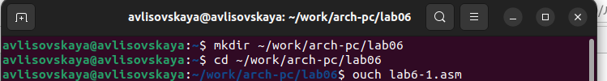{#fig:001 width=70%}

С помощью утилиты touch создаю файл lab6-1.asm (рис. [-@fig:002]).

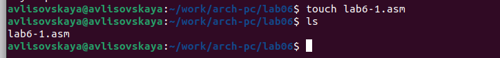{#fig:002 width=70%}

Копирую в текущий каталог файл in_out.asm с помощью утилиты cp, т.к. он будет использоваться в других программах (рис. [-@fig:003]). 

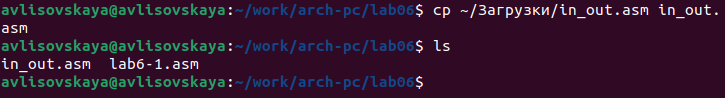{#fig:003 width=70%}

Открываю созданный файл lab6-1.asm, вставляю в него программу вывода значения регистра eax (рис. [-@fig:004]). 

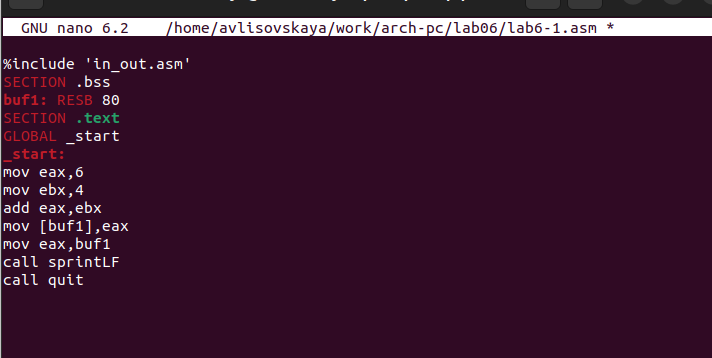{#fig:004 width=70%}

Создаю исполняемый файл программы и запускаю его (рис. [-@fig:005]). Вывод программы: символ j, потому что программа вывела символ, соответствующий по системе ASCII сумме двоичных кодов символов 4 и 6.

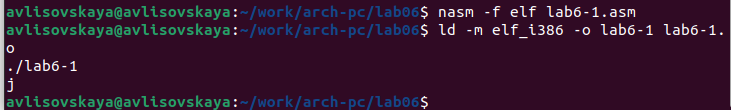{#fig:005 width=70%}

Изменяю в тексте программы символы "6" и "4" на цифры 6 и 4 (рис. [-@fig:006]). 

{#fig:006 width=70%}

Создаю новый исполняемый файл программы и запускаю его (рис. [-@fig:007]). Теперь вывелся символ с кодом 10, это символ перевода строки, этот символ не отображается при выводе на экран.

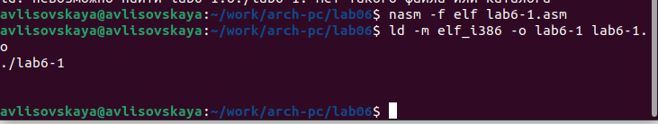{#fig:007 width=70%}

Создаю новый файл lab6-2.asm с помощью утилиты touch (рис. [-@fig:008]).

Ввожу в файл текст другойпрограммы для вывода значения регистра eax (рис. [-@fig:009]). 

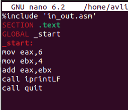{#fig:009 width=70%}

Создаю и запускаю исполняемый файл lab6-2 (рис. [-@fig:010]). Теперь вывод число 106, потому что программа позволяет вывести именно число, а не символ, хотя все еще происходит именно сложение кодов символов "6" и "4" 

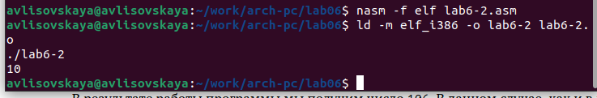{#fig:010 width=70%}

Заменяю в тексте программы в файле lab6-2.asm символы "6" и "4" на числа 6 и 4 (рис. [-@fig:011]).

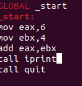{#fig:011 width=70%}

Создаю и запускаю новый исполняемый файл (рис. [-@fig:012]).. Теперь программа складывает не соответствующие символам коды в системе ASCII, а сами числа, поэтому вывод 10.

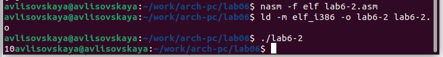{#fig:012 width=70%}

Заменяю в тексте программы функцию iprintLF на iprint (рис. [-@fig:013]).

{#fig:013 width=70%}

Создаю и запускаю новый исполняемый файл (рис. [-@fig:014]). Вывод не изменился, потому что символ переноса строки не отображался, когда программа исполнялась с функцией iprintLF, а iprint не добавляет к выводу символ переноса строки, в отличие от iprintLF.

{#fig:014 width=70%}

Выполнение арифметических операций в NASM

Создаю файл lab6-3.asm с помощью утилиты touch (рис. [-@fig:015]).

{#fig:015 width=70%}

Ввожу в созданный файл текст программы для вычисления значения выражения f(x) = (5 * 2 + 3)/3 (рис. [-@fig:016]).

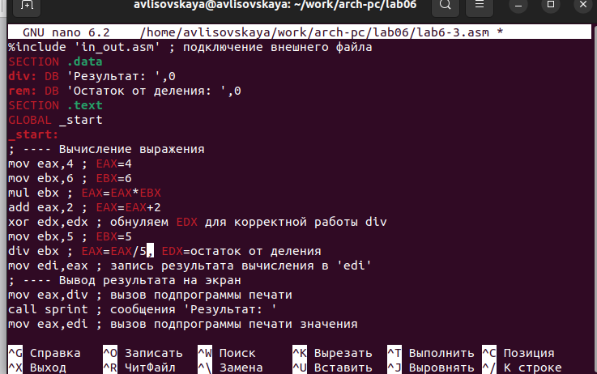{#fig:016 width=70%}

Создаю исполняемый файл и запускаю его (рис. [-@fig:017]).

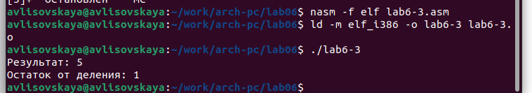{#fig:017 width=70%}

Изменяю программу так, чтобы она вычисляла значение выражения f(x) = (4 * 6 + 2)/5 (рис. [-@fig:018]).

{#fig:018 width=70%}

Создаю и запускаю новый исполняемый файл (рис. [-@fig:019]). Я посчитала для проверки правильности работы программы значение выражения самостоятельно, программа отработала верно.

{#fig:019 width=70%}

Создаю файл variant.asm с помощью утилиты touch (рис. [-@fig:020]).

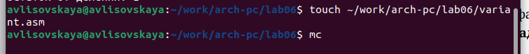{#fig:020 width=70%}

Ввожу в файл текст программы для вычисления варианта задания по номеру студенческого билета (рис. [-@fig:021]).

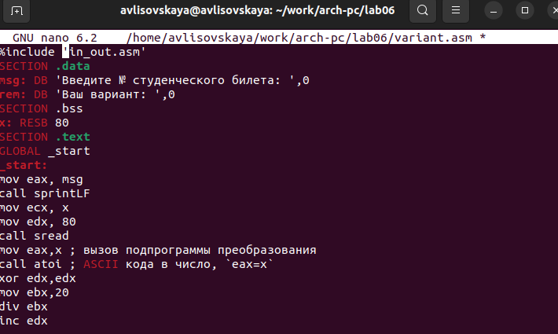{#fig:021 width=70%}

Создаю и запускаю исполняемый файл (рис. [-@fig:022]). Ввожу номер своего студ. билета с клавиатуры, программа вывела, что мой вариант - 8.

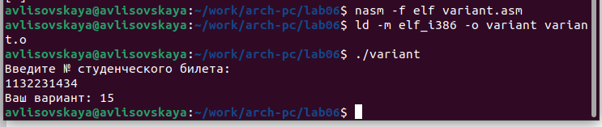{#fig:022 width=70%}

Ответы на вопросы по программе
1. oveax.rem" и строка "call sprint" отвечают за вывод на экран сообщения 'Ваш вариант:'.
2. Эти инструкции используются для чтения строки с вводом данных от пользователя. Начальный адрес строки сохраняется в регистре есх, а количество символов в строке (максимальное количество символов, которое может быть считано) сохраняется в регистре edx. Затем вызывается процедура sread, которая выполняет чтение строки.
3. Инструкция "call atoi" используется для преобразования строки в целое число. Она принимает адрес строки в регистре еах и возвращает полученное число в регистре еaх.
Строка "xoredx.edx" обнуляет регистр. edx перед выполнением деления. Строка "movebx,20" загружает значение 20 в регистр ebx. Строка "divebx" выполняет деление регистра еах на значение регистра ebx с сохранением частного в регистре еах и остатка в регистре edx,
5. Остаток от деления записывается в регистр edx.
6. Инструкция "inc edx" используется для увеличения значения в регистре edx на
1. В данном случае, она увеличивает остаток от деления на 1.
1з
7. Строка "moy eax.edx" передает значение остатка от деления в регистр eax. 36 Строка "call iprintLF" вызывает процедуруiprintLF для вывода значения на экран вместе с переводом строки.

## Задание для самостоятельной работы

Создаю файл lab6-4.asm с помощью утилиты touch (рис. [-@fig:023]).

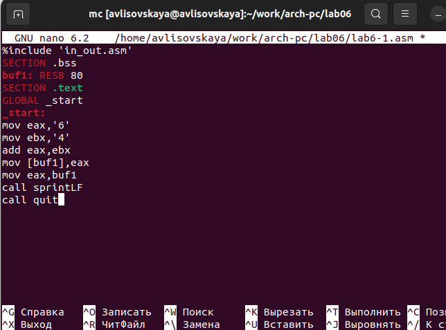{#fig:017 width=70%}

Открываю созданный файл для редактирования, ввожу в него текст программы для вычисления значения выражения (11 + x) * 2 - 6 (рис. [-@fig:024]). Это выражение было под вариантом 8. 

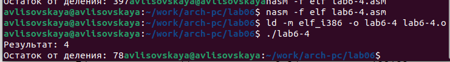{#fig:018 width=70%}

Создаю и запускаю исполняемый файл (рис. [-@fig:025]). 

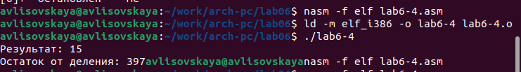{#fig:019 width=70%}

Провожу еще один запуск исполняемого файла для проверки работы программы с другим значением на входе (рис. [-@fig:026]). Программа отработала верно.

Программа для вычисления значения выражения (11 + x) * 2 − 6.

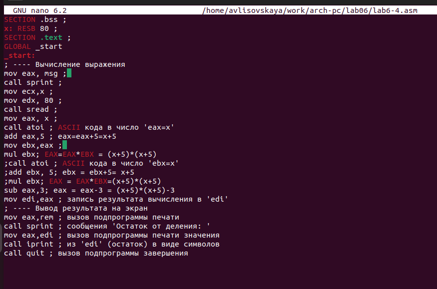{#fig:019 width=70%}

# Выводы
При выполнении данной лабораторной работы я освоила арифметические инструкции языка ассемблера NASM
