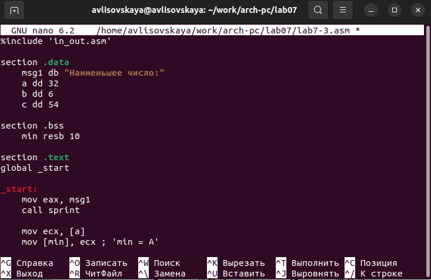

---
## Front matter
title: "ОТЧЕТ ПО ЛАБОРАТОРНОЙ РАБОТЕ № 7"
subtitle: "дисциплина:	Архитектура компьютера"
author: "Лисовская Арина Валерьевна"

## Generic otions
lang: ru-RU
toc-title: "Содержание"

## Bibliography
bibliography: bib/cite.bib
csl: pandoc/csl/gost-r-7-0-5-2008-numeric.csl

## Pdf output format
toc: true # Table of contents
toc-depth: 2
lof: true # List of figures
fontsize: 12pt
linestretch: 1.5
papersize: a4
documentclass: scrreprt
## I18n polyglossia
polyglossia-lang:
  name: russian
  options:
	- spelling=modern
	- babelshorthands=true
polyglossia-otherlangs:
  name: english
## I18n babel
babel-lang: russian
babel-otherlangs: english
## Fonts
mainfont: PT Serif
romanfont: PT Serif
sansfont: PT Sans
monofont: PT Mono
mainfontoptions: Ligatures=TeX
romanfontoptions: Ligatures=TeX
sansfontoptions: Ligatures=TeX,Scale=MatchLowercase
monofontoptions: Scale=MatchLowercase,Scale=0.9
## Biblatex
biblatex: true
biblio-style: "gost-numeric"
biblatexoptions:
  - parentracker=true
  - backend=biber
  - hyperref=auto
  - language=auto
  - autolang=other*
  - citestyle=gost-numeric
## Pandoc-crossref LaTeX customization
figureTitle: "Рис."
tableTitle: "Таблица"
listingTitle: "Листинг"
lofTitle: "Список иллюстраций"
lolTitle: "Листинги"
## Misc options
indent: true
header-includes:
  - \usepackage{indentfirst}
  - \usepackage{float} # keep figures where there are in the text
  - \floatplacement{figure}{H} # keep figures where there are in the text
---

# Цель работы

Изучить основы работы комманд усовного и безусловного перехода в assembler.

# Задание

    1.Символьные и численные данные в NASM
    2.Выполнение арифметических операций в NASM
    3.Выполнение заданий для самостоятельной работы

# Выполнение лабораторной работы

## Символьные и численные данные в NASM

Создадим рабочую папку и рабочий файл  (рис. [-@fig:001]).

{#fig:001 width=70%}

Запишем в файл код, проассемблируем его, запустим(рис. [-@fig:002])

{ #fig:002 width=70% }

Напишем программу с условным переходом(рис. [-@fig:003])

{ #fig:003 width=70% }

Рассмотрим файл листинга одной из программ(рис. [-@fig:004]) { #fig:004 width=70% }

в строке 9 содержится собственно номер сторки [9], адресс [00000003], машинный код [803800] и содержимое строки кода [cmp byte [eax], 0] в строке 11 содержится номер сторки [11], адресс [00000008], машинный код [40] и содержимое строки кода [inc eax] в строке 24 содержится номер сторки [24], адресс [0000000F], машинный код [52] и содержимое строки кода [push edx]

Если в коде появляется ошибка, то ее описание появится в файле листинга(рис. [-@fig:005])

{ #fig:005 width=70% }

## Задание для самостоятельной работы
(Вар 15)

программа для сравнения трех заранее известных чисел(рис. [-@fig:006]) и ее работа(рис. [-@fig:007])

{ #fig:006 width=70% } { #fig:007 width=70% }

Программа для вычисления выражения в зависимости от условия на одну из вводимых переменных(рис. [-@fig:008]) и ее работа(рис. [-@fig:009]) (рис. [-@fig:009])

{ #fig:008 width=70% }
{ #fig:009 width=70% }
{ #fig:008 width=70% }

# Выводы
Были изучены основные принципы работы с условным и безусловным переходом в assembler и изучены основы чтения файлов листинга.
